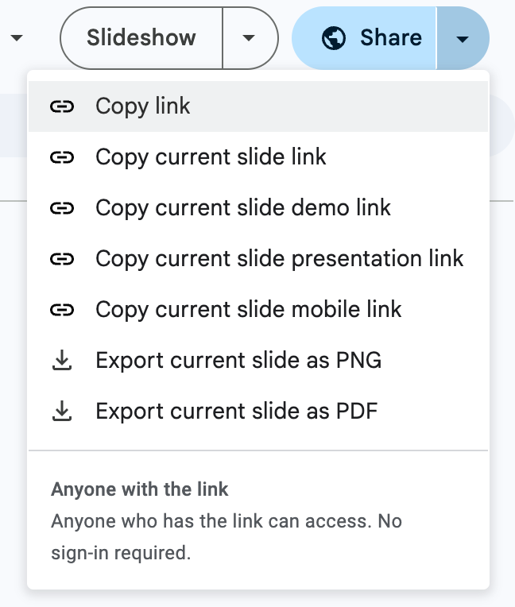

# Google Slides Current Slide Link Extension

A Chrome extension that seamlessly adds a "Copy current slide link" button to Google Slides share dialogs, allowing you to quickly share direct links to the current slide.



## ⚠️ Disclaimer

**This extension is not affiliated with, endorsed by, or connected to Google Inc. in any way.** This is an independent, open-source project created to enhance the Google Slides user experience.

**Use at your own risk.** The author is not responsible for any damages, data loss, or issues that may arise from using this extension. By installing and using this extension, you acknowledge that you understand and accept these terms.

## ✨ Features

- **🎯 One-click slide sharing**: Copy direct links to specific slides instantly
- **🔗 Smart URL generation**: Automatically detects current slide and creates proper URLs
- **📱 Native integration**: Perfectly matches Google's Material Design UI
- **⚡ Event-driven performance**: Efficient background processing with minimal resource usage
- **🛡️ Robust overlay positioning**: Works reliably across different screen sizes and dialog states
- **✅ Visual feedback**: Clear confirmation when URL is copied to clipboard

## 🚀 Installation

### Option 1: Load Unpacked (Development)
1. Download or clone this repository:
   ```bash
   git clone https://github.com/yourusername/google-slides-current-slide-link.git
   ```
2. Open Chrome and navigate to `chrome://extensions/`
3. Enable "Developer mode" using the toggle in the top-right corner
4. Click "Load unpacked" and select the extension folder
5. The extension is now active!

### Option 2: Chrome Web Store
*Coming soon - extension will be published to the Chrome Web Store*

## 📖 How to Use

1. **Open any Google Slides presentation**
2. **Click the "Share" button** in the top-right corner
3. **Look for the "Copy current slide link" button** - it appears next to Google's "Copy link" button
4. **Click the button** to instantly copy the current slide's URL to your clipboard
5. **See the confirmation** - button briefly shows "Copied!" to confirm success

### URL Format
The extension generates URLs in this format:
```
https://docs.google.com/presentation/d/[PRESENTATION_ID]/edit#slide=id.[SLIDE_ID]
```

## 🔧 Development

### Project Structure
```
├── manifest.json          # Extension manifest (v3)
├── content.js            # Main content script (1400+ lines)
├── styles.css            # UI styling
├── icon16.png           # Extension icons
├── icon48.png
├── icon128.png
├── PROJECT_LEARNINGS.md  # Technical documentation
├── .cursorrules         # Development guidelines
└── README.md            # This file
```

### Key Files
- **`content.js`**: Event-driven slide detection and UI injection
- **`styles.css`**: Google Material Design compliant styling
- **`manifest.json`**: Chrome Extension Manifest V3 configuration

## 🧠 Architecture Insights
### Why Overlay Positioning?
- **Google's security**: Prevents direct DOM modifications
- **Reliability**: Immune to Google's UI updates
- **Performance**: No conflicts with Google's scripts

### State Management
```javascript
// Simple flag-based state management
const state = {
  isInjecting: false,
  dialogFound: false,
  loggedElements: new Map()
};
```

## 📊 Browser Compatibility

- **Chrome**: ✅ Fully supported (Manifest V3)
- **Edge**: ✅ Should work (Chromium-based)

## 🤝 Contributing
Contributions are welcome! Please feel free to submit issues or pull requests.
Feel free to reach out to me at omri.ariav at gmail dot com

### Development Guidelines
- Follow the patterns in `.cursorrules`
- Review `PROJECT_LEARNINGS.md` for technical insights

## 📄 License

This project is licensed under the MIT License - see the [LICENSE](LICENSE) file for details.

## ⚠️ Legal Disclaimer

**IMPORTANT**: This extension is an independent, third-party tool and is **NOT affiliated with, endorsed by, or sponsored by Google Inc.** or any of its subsidiaries. Google, Google Slides, and related trademarks are the property of Google Inc.

**LIABILITY DISCLAIMER**: This software is provided "AS IS" without warranty of any kind. The author shall not be held liable for any damages, losses, or issues arising from the use of this extension, including but not limited to:
- Data loss or corruption
- Privacy or security issues  
- Conflicts with Google Slides functionality
- Browser performance impacts
- Any other direct or indirect damages

**By downloading, installing, or using this extension, you acknowledge that you have read this disclaimer and agree to use the software at your own risk.**
